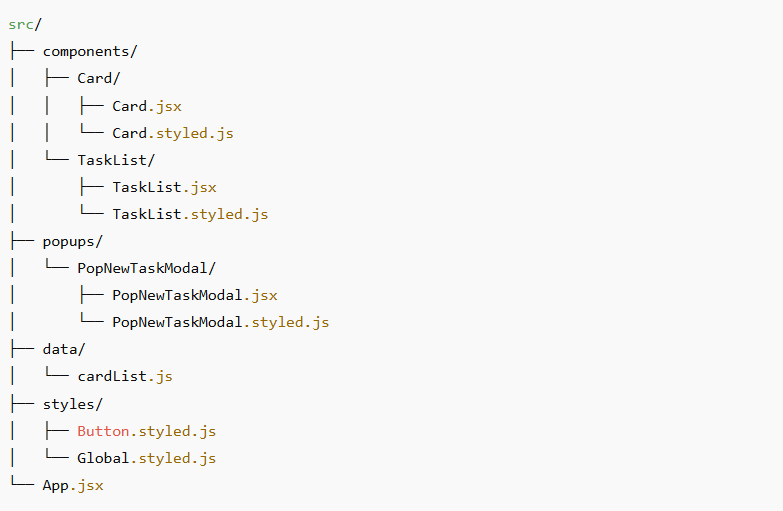

📝 Task Manager App

A React-based web application that displays, edits, and manages tasks created through the Telegram Task Manager System.

This app is not a standalone task manager —
it serves as the web interface for viewing and managing tasks that are created through a Telegram bot, processed via AssemblyAI, and stored in Supabase (PostgreSQL).
All task data is loaded via API requests directly from the database.

🚀 Features

➕ Add new tasks via a clean popup modal

🗑️ Delete tasks instantly

💾 Persistent storage using localStorage

🎨 Responsive and modern UI built with styled-components

⚡ Fast and minimal setup, no backend required

### 🧩 Tech Stack

Frontend

- ⚛️ **React** — UI library for building interactive interfaces
- 💅 **Styled-components** — CSS-in-JS for scoped component styling
- 📅 **React Datepicker** — calendar component for selecting task dates
- 💾 **Local Storage API** — client-side data persistence
- 🔗 Supabase JS Client — fetching and modifying tasks via AP

Backend (external system)

- 🤖 Telegram Bot (grammY) — creates tasks from text or voice
- 🎤 AssemblyAI — transcribes voice messages
- 🗄️ Supabase (PostgreSQL) — stores all task data

📂 Project Structure

⚙️ Installation & Setup

Clone the repository:

git clone https://github.com/yourusername/kanban-board.git

Navigate into the project folder:

cd kanban-board

Install dependencies:

npm install

Start the development server:

npm start dev

💡 Usage

Click “Add New Task” to open the modal.

Enter your task name and press Add Task.

Your task will appear in the main grid.

To delete a task, click the 🗑️ icon on its card.

